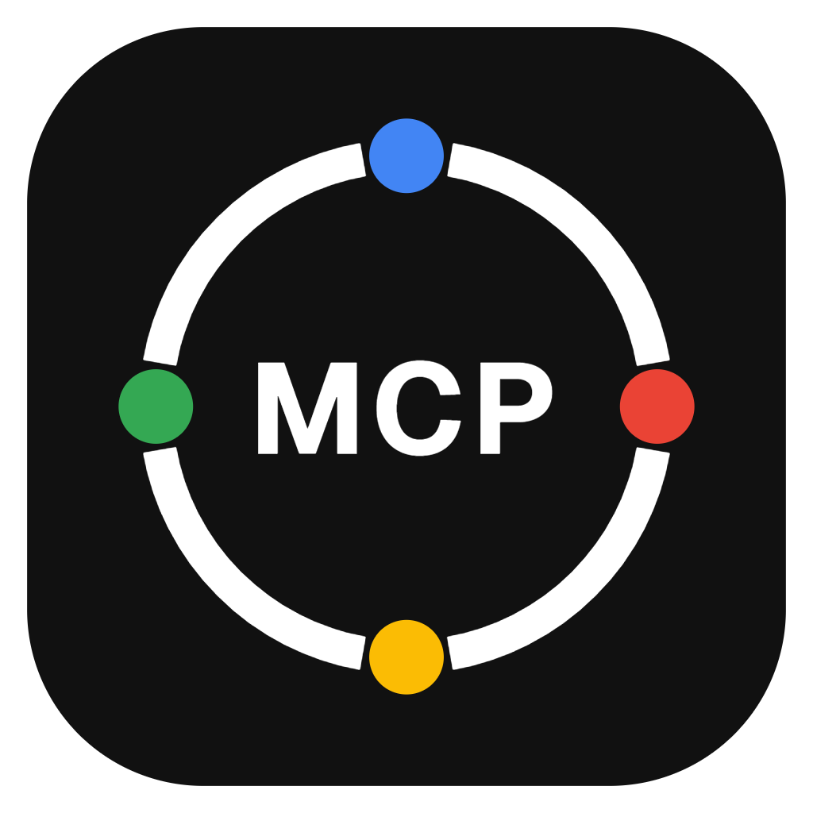

<div align="center">



# gmail-multi-mcp

**An MCP server that connects your AI assistant to *several* Google accounts at once —
Gmail, Drive, Calendar and Contacts.**

[](./LICENSE)
[](https://nodejs.org)
[](./tsconfig.json)
[](https://modelcontextprotocol.io)
[](#the-tools)

</div>

---

## Why this exists

**The official connectors handle one account.** If your work lives in `you@company.com`,
your invoices arrive at `billing@company.com` and your life happens in `you@gmail.com`, you
end up switching connectors — or simply cannot ask a question that spans two of them.

This server makes the account a first-class parameter, and then goes one step further:

```
"Any unread invoices this week, and do I have a free hour to deal with them?"

  → search_emails          searches work@, billing@ and personal@ in parallel
  → calendar_find_free_time gaps that are free on ALL THREE calendars
  → one answer
```

Omit the account and it searches **every mailbox, every Drive, every calendar and every
address book** you have connected. One Google Cloud project, as many accounts as you want.

---

## Features

- **Multi-account by design.** Add as many Google accounts as you like; each keeps its own
  credentials.
- **Cross-account by default.** `search_emails`, `drive_search`, `calendar_list_events`,
  `calendar_find_free_time` and `contacts_search` all work across every connected account
  when you omit `account`.
- **Degrades instead of failing.** If one account's token is revoked, the others still
  return — and the broken one is reported in a `failures` field rather than silently
  dropped.
- **Free time across accounts.** `calendar_find_free_time` intersects the busy blocks of
  several calendars. If it cannot read one of them it returns **no slots at all** rather
  than a confident answer built on half the picture.
- **Aliases.** Call an account `work` or `personal` instead of typing the full address.
- **Standard OAuth, no password ever.** Consent happens in your browser, on Google's own
  screen, through a CSRF-protected loopback callback.
- **Tokens stay on your machine**, in your home directory, `0600` on Unix — never in the
  repository, never in the MCP client configuration.
- **Automatic token refresh**, written back to disk so a restart does not re-refresh.
- **Per-service scope gate.** An account authorised before Drive existed keeps doing Gmail
  and gets a clear `MISSING_SCOPE` for Drive — not a baffling Google 403.
- **Twenty-six tools** across mail, files, calendar and contacts.
- **Contacts that cannot be clobbered.** `contacts_update` re-reads the contact for its
  `etag` before writing, so a change made on a phone thirty seconds earlier is not silently
  overwritten.
- **Cannot permanently delete email.** The Gmail scope does not allow it and no tool
  exposes it.
- **Strict TypeScript**, no `any`, and a dependency list you can read in one glance.

---

## Prerequisites

| | |
|---|---|
| **Node.js** | **≥ 20.12** — see the note below |
| **Google Cloud** | A free account. No billing needed for personal use. |
| **An MCP client** | Claude Code, Claude Desktop, or anything that speaks MCP over stdio. |

> **Why 20.12 and not 18.** The server loads a local `.env` with Node's built-in
> `process.loadEnvFile()`, which landed in **20.12** (and 21.7). On Node 18 that file would
> be ignored *silently*, and you would get a confusing "no credentials" error with a
> perfectly good `.env` sitting right there. The floor is real, not cautious.

---

## Installation

```bash
git clone https://github.com/blackwings-dev/gmail-multi-mcp.git
cd gmail-multi-mcp
npm install
npm run build
```

That produces `dist/index.js`, which is what your MCP client will run. Check it:

```bash
node dist/index.js --version
```

---

## Google Cloud setup

You do this **once**, no matter how many accounts you connect. About five minutes.

### 1. Create a project

Open the [Google Cloud Console](https://console.cloud.google.com/) and create a project —
call it whatever you like, e.g. `google-mcp`.

### 2. Enable **four** APIs

With your new project selected, enable each of these. Missing one produces a 403 that says
nothing useful, and only for the tools that need it:

| API | Direct link |
|---|---|
| **Gmail API** | <https://console.cloud.google.com/apis/library/gmail.googleapis.com> |
| **Google Drive API** | <https://console.cloud.google.com/apis/library/drive.googleapis.com> |
| **Google Calendar API** | <https://console.cloud.google.com/apis/library/calendar-json.googleapis.com> |
| **People API** *(contacts)* | <https://console.cloud.google.com/apis/library/people.googleapis.com> |

Contacts live behind the **People API**, not a "Contacts API". Looking for the latter in
the library and finding the long-dead Contacts API v3 is the usual wrong turn.

Press **Enable** on each. Nothing else on those pages matters.

### 3. Configure the consent screen

In the sidebar this now lives under **Google Auth Platform**; older projects show it as
*APIs & Services → OAuth consent screen*.

| Field | What to put |
|---|---|
| **App name** | Anything, e.g. `Google MCP`. Only you will see it. |
| **User support email** | Your own address. |
| **Audience / User type** | **External** |
| **Developer contact** | Your own address again. |

Then, under **Audience → Test users**, press **Add users** and add **every Google address
you intend to connect**.

> ⚠️ **This step is not optional.** While the app is in *Testing*, an account that is not
> listed as a test user **cannot grant consent** — Google shows an "access blocked" screen
> that does not explain why.

### 4. Create the OAuth client

**APIs & Services → Credentials → Create Credentials → OAuth client ID**

| Field | Value |
|---|---|
| **Application type** | **Desktop app** ← this exact type |
| **Name** | Anything, e.g. `gmail-multi-mcp` |

Copy the **Client ID** and **Client secret** from the dialog that appears.

> **Why "Desktop app" specifically.** That client type accepts any loopback port as a
> redirect URI. The setup flow opens a throwaway server on a random free port and hands
> that URL to Google, so you never register redirect URIs by hand — which is exactly what
> lets a single project serve any number of accounts.

---

## Scopes, and what they cost you

This server asks for four scopes:

| Scope | What it buys | Google's tier |
|---|---|---|
| `.../auth/gmail.modify` | Read, draft, send, label. **Not** permanent deletion. | Restricted |
| `.../auth/drive` | Full access to the user's files. | Restricted |
| `.../auth/calendar` | Read and write events, and free/busy. | Sensitive |
| `.../auth/contacts` | Read and write the account’s own contacts. | Sensitive |

**Be aware of what full `drive` costs**, because it changes your options later. Google
classes it as a *restricted* scope, the same tier as `gmail.modify`. The narrower
`drive.file` — access limited to files this app created or that the user explicitly picked
in a Google file picker — is **not** restricted and would keep the verification story
simpler. But `drive.file` cannot see files you already have, which means `drive_search`
over your existing Drive would return nothing. That is the whole trade-off: **searchable
Drive, or an easier path through Google's review.**

Full `drive` is the deliberate choice here. Switching is a one-line change in
[`src/auth/oauth.ts`](./src/auth/oauth.ts) (`DRIVE_SCOPES`) followed by re-authorising your
accounts.

`contacts` is read **and** write because `contacts_create` and `contacts_update` exist;
`contacts.readonly` would do if you only ever look. It does not cover Google’s "other
contacts" — the addresses Gmail collects by itself — which sit behind a separate scope this
server does not ask for.

---

## Configuring the server

### 1. Credentials

```bash
cp .env.example .env
```

```dotenv
GOOGLE_CLIENT_ID=1234567890-abcdefg.apps.googleusercontent.com
GOOGLE_CLIENT_SECRET=GOCSPX-your-secret-here
```

`.env` is git-ignored. You can also skip this file entirely — `npm run setup` will ask for
the credentials and store them in `~/.gmail-multi-mcp/config.json`. If both exist, the
environment wins.

### 2. Connect your accounts

```bash
npm run setup
```

```
  gmail-multi-mcp
  Gmail, Drive and Calendar. One Google Cloud project, as many accounts as you need.

  config  C:\Users\you\.gmail-multi-mcp\config.json
  tokens  C:\Users\you\.gmail-multi-mcp\tokens

✔ OAuth credentials found in the environment.

What now?
─────────
  1  Add a Google account
  2  List accounts
  3  Remove an account
  4  Show MCP client configuration
  q  Quit
```

Choose **1**. A browser opens and you sign in. Google’s consent screen lists Gmail, Drive,
Calendar and Contacts; grant them, and the tab says *"Account connected"*. The CLI then asks for an optional **alias** —
`work`, `personal`, `billing` — which you can use instead of the full address from then on.

> ### ⚠️ Adding a second account
>
> **Sign out of Google first, or use a private/incognito window.**
>
> Otherwise the browser reuses the session you already have, Google skips the account
> chooser, and you connect the *same* account twice without noticing.

Repeat for each account, then check the result with option **2**.

### 3. Register the server with Claude Code

```bash
claude mcp add gmail-multi-mcp \
  --scope user \
  -e GOOGLE_CLIENT_ID=your-client-id.apps.googleusercontent.com \
  -e GOOGLE_CLIENT_SECRET=GOCSPX-your-secret \
  -- node /absolute/path/to/gmail-multi-mcp/dist/index.js
```

On Windows the path looks like `D:\Dev\gmail-multi-mcp\dist\index.js`. Verify with
`claude mcp list`, then **restart Claude Code** so it picks the server up.

<details>
<summary><b>Claude Desktop, or any other MCP client</b></summary>

```json
{
  "mcpServers": {
    "gmail-multi-mcp": {
      "command": "node",
      "args": ["/absolute/path/to/gmail-multi-mcp/dist/index.js"],
      "env": {
        "GOOGLE_CLIENT_ID": "your-client-id.apps.googleusercontent.com",
        "GOOGLE_CLIENT_SECRET": "GOCSPX-your-secret"
      }
    }
  }
}
```

The `env` block is optional if the credentials are already in
`~/.gmail-multi-mcp/config.json`. Account tokens are always read from there — they never go
in the client configuration.

Option **4** in the setup CLI prints this snippet with the correct absolute path already
filled in.

</details>

---

## ⚠️ Upgrading from a Gmail-only version? Re-authorise

**If you connected your accounts when this server only did Gmail, they will keep working
for Gmail and fail for everything else.** Drive and Calendar tools will answer:

```
MISSING_SCOPE — <account> is authorised, but not for Drive.
```

**A refresh will not fix this.** Google binds a refresh token to the exact set of scopes
granted when it was issued, so no amount of restarting, re-refreshing or waiting will add
Drive and Calendar. Only a fresh consent will.

The fix takes a minute per account:

```bash
npm run setup
```

The CLI tells you which accounts are affected before you do anything:

```
! 3 accounts need re-authorising:
    · you@company.com
    · billing@company.com
    · you@gmail.com
  They were connected before Drive and Calendar support existed, so they can only
  do Gmail right now. A refresh cannot add the missing scopes: Google binds a
  refresh token to the scopes it was issued with. Choose 1 and add each account
  again — it re-consents and overwrites in place, so nothing has to be removed.
```

Choose **1** and add each account again. **You do not have to remove them first**: the flow
always asks for fresh consent and overwrites the stored token in place, keeping the alias.

Your assistant can check this for itself at any time — `list_accounts` reports
`missingScopes` and `needsReauthorization` per account, and a `warning` summarising them.

And do not forget **step 2 of the Google Cloud setup**: an account with the right scopes
still fails if the Drive or Calendar API is not enabled on the project.

---

## Usage

Ask in natural language. A few that exercise different corners:

| What you say | What happens |
|---|---|
| *"Any unread invoices this week?"* | `search_emails` across **all** mailboxes, merged |
| *"Find the Q3 budget spreadsheet in any of my Drives"* | `drive_search` across **all** accounts |
| *"Read me that spreadsheet"* | `drive_read` — exported to CSV |
| *"Draft a reply to Ana with the numbers from it"* | `drive_read` + `create_draft` |
| *"Write those notes up as a Google Doc in my work account"* | `drive_create_doc` |
| *"Share it with marta@client.com as a commenter"* | `drive_share` |
| *"What's on my calendars tomorrow?"* | `calendar_list_events` across **all** accounts |
| *"Find me two free hours next week across all my accounts"* | `calendar_find_free_time` |
| *"Book it as 'Budget review' and invite Marta"* | `calendar_create_event` |
| *"Move Thursday's stand-up an hour later"* | `calendar_update_event` |
| *"What's Marta's phone number?"* | `contacts_search` across **all** address books |
| *"Add her to my work contacts with that email"* | `contacts_create` |

Habits worth having:

- Ask for a **draft** unless you really want the mail sent. `reply` and `send_message` go
  out immediately and there is no undo.
- Name the account (*"in my work account"*) when you mean one; leave it out when you want
  all of them.
- `calendar_delete_event` and `drive_share` are the two that change things you cannot take
  back from here. Be explicit with them.

---

## The tools

`account` accepts an email address **or an alias**. Where it is *optional*, omitting it
means "every connected account, merged".

### Accounts

| Tool | Description | Parameters |
|---|---|---|
| `list_accounts` | Configured accounts, their scopes, and which need re-authorising | `probe?` — contact Google to confirm (slower, catches revoked tokens) |

### Gmail

| Tool | Description | Parameters |
|---|---|---|
| `search_emails` | Gmail query syntax. **Without `account`, searches every mailbox** | `query`, `account?`, `max_results?` (1–100, default 20) |
| `read_thread` | A full conversation, every message in order | `thread_id`, `account` |
| `read_message` | One message: decoded body plus attachment metadata | `message_id`, `account` |
| `create_draft` | Saves a draft **without sending** | `account`, `to[]`, `subject`, `body`, `cc?`, `bcc?`, `is_html?`, `thread_id?` |
| `reply` | Replies in-thread — handles `Re:`, `In-Reply-To`, `References`. **Sends.** | `account`, `message_id`, `body`, `reply_all?`, `is_html?` |
| `send_message` | Composes and sends a new email. **No undo.** | `account`, `to[]`, `subject`, `body`, `cc?`, `bcc?`, `is_html?`, `thread_id?` |
| `list_labels` | Labels of an account, with their ids | `account` |
| `label_message` | Adds and/or removes labels; accepts names or ids | `account`, `message_id`, `add_labels?`, `remove_labels?` |

Useful system labels: `UNREAD` (remove it to mark as read), `STARRED`, `IMPORTANT`, `SPAM`,
`TRASH`. Adding `TRASH` moves a message to the bin, where it is recoverable — **nothing
here deletes mail permanently**. Attachment *metadata* is returned; attachment contents are
not downloaded.

### Drive

| Tool | Description | Parameters |
|---|---|---|
| `drive_search` | **Without `account`, searches every Drive.** `query` is free text over name and contents; `drive_query` takes raw Drive query syntax | `query?`, `drive_query?`, `account?`, `max_results?` (1–100, default 20), `include_trashed?` |
| `drive_read` | Reads a file as text | `file_id`, `account`, `max_chars?` (default 60000) |
| `drive_list` | Lists a folder, sub-folders first | `account`, `folder_id?` (default `root`), `max_results?` |
| `drive_upload` | Uploads a file. Exactly one of `content` or `local_path` | `account`, `name`, `content?`, `local_path?`, `mime_type?`, `parent_folder_id?` |
| `drive_create_doc` | Creates a real Google Doc from plain text | `account`, `name`, `content?`, `parent_folder_id?` |
| `drive_share` | Grants access. **Gives away real data.** | `account`, `file_id`, `type`, `role`, `email_address?`, `domain?`, `notify?`, `message?` |

**`drive_read` conversions:** Google Docs → `text/plain`, Sheets → `text/csv`, Slides →
`text/plain`. Ordinary text files are downloaded as they are. **Binary files (PDF, images,
archives) are refused** with a link instead — this server does not download them. Content
over `max_chars` is cut and says so; files over 10 MB are refused.

**`drive_share` types:** `user` and `group` need `email_address`; `domain` needs `domain`;
`anyone` makes the file readable by **anyone with the link**. Roles are `reader`,
`commenter` or `writer` — ownership transfer is deliberately not offered. No notification
email is sent unless `notify` is true.

### Contacts

Contacts are handled through Google’s **People API**.

| Tool | Description | Parameters |
|---|---|---|
| `contacts_search` | **Without `account`, searches every address book.** Matches names, nicknames, emails, phone numbers and organisations | `query`, `account?`, `max_results?` (1–100, default 20) |
| `contacts_get` | One contact in full: every email and phone with its label, organisation, addresses, links, notes | `account`, `resource_name` |
| `contacts_list` | Pages through an address book, most recently changed first | `account`, `page_size?` (1–200, default 50), `page_token?` |
| `contacts_create` | Adds a person. At least one field required | `account`, `given_name?`, `family_name?`, `emails?`, `phones?`, `organization?`, `job_title?`, `notes?` |
| `contacts_update` | Changes a person. **Each named field is replaced, not merged** | `account`, `resource_name`, + any of the create fields |

**`resource_name` looks like `people/c1234567890`** and comes from `contacts_search` or
`contacts_list`.

**⚠️ `contacts_update` replaces whole fields.** Sending `emails: ["new@x.com"]` leaves the
contact with exactly that one address and deletes the rest. Fields you do not name are left
alone — so read the contact first and send back the complete list of whatever you are
editing. The current version is re-read for its `etag` before writing, so an edit made on a
phone in the meantime cannot be silently overwritten.

**The same person in two accounts is returned twice**, on purpose. Each copy has its own
`resource_name` in its own address book; merging them would produce an id that edits the
wrong one.

**Paging:** `contacts_list` returns `nextPageToken` when there is more. Pass it back as
`page_token`.

### Calendar

| Tool | Description | Parameters |
|---|---|---|
| `calendar_list_events` | **Without `account`, reads every calendar.** Repeating events are expanded into real occurrences | `time_min`, `time_max`, `account?`, `calendar_id?`, `max_results?` (1–250, default 25), `query?` |
| `calendar_get_event` | One event in full, with attendees and their responses | `account`, `event_id`, `calendar_id?` |
| `calendar_create_event` | Creates an event | `account`, `summary`, `start`, `end`, `all_day?`, `time_zone?`, `description?`, `location?`, `attendees?`, `calendar_id?`, `send_updates?` |
| `calendar_update_event` | Changes an event. `start` and `end` go together or not at all | `account`, `event_id`, + any of the create fields |
| `calendar_delete_event` | Deletes an event. **Irreversible.** | `account`, `event_id`, `calendar_id?`, `send_updates?` |
| `calendar_find_free_time` | Gaps free on **every** account asked about | `time_min`, `time_max`, `accounts?`, `timezone?`, `workday_start?`, `workday_end?`, `weekdays_only?`, `minimum_minutes?`, `calendar_id?` |

**Times must carry an explicit offset** — `2026-09-10T09:00:00+02:00` or a `Z`. A bare
`2026-09-10T09:00:00` is **refused**, on purpose: it would be read in whatever zone the
server happens to run in, and the resulting answer looks completely normal while being
hours wrong.

**All-day events** use plain dates (`YYYY-MM-DD`) with `all_day: true`. Google treats the
end date as **exclusive**, so a one-day event ends on the following day.

**`send_updates` defaults to `none`** — attendees are added to the event but not emailed
unless you ask. Values: `all`, `externalOnly`, `none`.

#### The `calendar_find_free_time` contract

This is the one tool where a wrong answer looks exactly like a right one, so its rules are
worth stating:

- `time_min` / `time_max` must carry an explicit offset. Maximum range: **62 days**.
- Working hours (`workday_start`, `workday_end`, default `09:00`–`18:00`) are interpreted
  in `timezone`, an **IANA name** like `Europe/Madrid`. It defaults to the zone the server
  runs in, and is **always echoed back** in the result so you can see what was assumed.
  Daylight saving is handled; the offset is resolved per day, not fixed once.
- `weekdays_only` defaults to **true**.
- A busy block that overlaps a candidate window only partially still removes the
  overlapping part. Half a busy hour is not free.
- Returned slots are the free **segments** of at least `minimum_minutes` (default 30), in
  UTC, not a grid of fixed start times.
- **If any calendar cannot be read, no slots are returned at all.** The result carries
  `incomplete: true`, the `failures`, and an explanation. A gap computed without one
  person's calendar is a double-booking, not an answer.

---

## Troubleshooting

### `MISSING_SCOPE — <account> is authorised, but not for Drive`

The account was connected before Drive and Calendar support existed. See
[Re-authorise](#️-upgrading-from-a-gmail-only-version-re-authorise) above. A refresh cannot
fix it; only a fresh consent can.

### `Access denied by Drive: Request had insufficient authentication scopes`

The scope gate let this through, so the stored token *claims* the scope but Google
disagrees — usually a half-finished re-authorisation. Add the account again.

### `Access denied by Drive` / `by Calendar` / `by Contacts` (HTTP 403)

The API is not enabled on the Google Cloud project. Enabling one does not enable the others
— see [step 2](#2-enable-four-apis). For contacts the one you need is the **People API**.

### `contacts_search` finds nothing, but the person is definitely there

Google’s contact search reads a server-side index that has to be warmed with an empty query
before it answers anything. This server does that on the first search per account and
retries once after a short pause, so you should not meet it — but if a brand new search
comes back empty, ask again. A second attempt against a warm cache is the difference
between "no such person" and "not ready yet".

### A contact lost its other email addresses after an update

`contacts_update` **replaces** each field it is given. Passing one address removes the
others. Read the contact with `contacts_get` first and send the full list back.

### `HTTP ERROR 431 (Request Header Fields Too Large)` on the callback

Fixed in current versions — if you see it, you are on an old build. The cause is worth
knowing: the redirect used to go to `localhost`, which is a **shared cookie origin**. Every
dev server you have ever run on any `localhost` port can leave cookies there, and the
browser sends *all of them* to the OAuth callback. Past roughly 16 KB that exceeds Node's
default header limit — and it fails **after** Google has already granted consent, so the
authorisation code is lost.

The redirect now targets `127.0.0.1`, which does not receive `localhost` cookies, and the
callback server accepts 64 KB of headers. If it somehow still happens, clear cookies for
`127.0.0.1` and retry.

### Accounts stop working after 7 days

Your OAuth consent screen is still in **Testing**, and Google expires refresh tokens for
apps in that state after seven days. Two options, neither free:

- **Stay in Testing** and re-run `npm run setup` once a week.
- **Publish the app** (*Google Auth Platform → Audience → Publish app*). Refresh tokens
  stop expiring. In exchange, an app that has not been through Google's review shows an
  **"unverified app" warning screen** on every consent and is capped at a limited number of
  users.

Two of the four scopes here are **restricted** (`gmail.modify`, `drive`), the category
Google reviews most closely, and that review policy changes. Check the current requirements
on the consent screen itself before assuming publishing will be waved through.

### `Unknown account "..."`

The reference did not match any configured email or alias. Run `npm run setup` and choose
**2**, or ask your assistant to call `list_accounts`.

### `Google did not return a refresh token`

Google issues one only on **first** consent. Revoke the app at
[myaccount.google.com/permissions](https://myaccount.google.com/permissions), then
authorise again.

### `time_min must be ISO 8601 with an explicit UTC offset`

Working as intended. Send `2026-09-10T09:00:00+02:00`, not `2026-09-10T09:00:00`.

### You connected the same account twice

The browser reused an existing Google session. Remove the duplicate with option **3**, then
add the other account from a private window.

### Your MCP client shows a JSON parse error and disconnects

Something wrote to stdout. On the stdio transport, **stdout is the protocol**. If you are
modifying this server, every diagnostic must go to stderr — never `console.log`.

### A cross-account search returns fewer results than expected

Look at the `failures` field of the response. An account whose token was revoked is
reported there rather than silently skipped.

---

## Security

- **Tokens never leave your machine.** They live in `~/.gmail-multi-mcp/tokens/`, one file
  per account, `chmod 0600` on Unix. Nothing is sent anywhere except Google.
- **Nothing sensitive is in the repository.** `.gitignore` covers `.env` and every `.env.*`
  except the example.
- **CSRF-protected callback.** A random `state` is generated per flow and compared in
  constant time; a callback that does not match is rejected.
- **Loopback only.** The callback server binds `127.0.0.1`, on an ephemeral port, and shuts
  down as soon as the code arrives.
- **Header injection blocked.** CR/LF is stripped from every outgoing mail header, so a
  crafted subject or recipient cannot inject extra headers.
- **No permanent mail deletion.** The Gmail scope cannot do it and no tool offers it.
- **About the client secret:** for **Desktop app** clients Google does not treat it as
  confidential — an installed application cannot keep a secret, which is why this flow is
  designed not to depend on one. Keep it out of your repository anyway.
- **Removing an account** deletes the local token but does **not** revoke Google's grant.
  Revoke it fully at
  [myaccount.google.com/permissions](https://myaccount.google.com/permissions).

### ⚠️ What you are handing an assistant, and the risk that comes with it

This server can **read untrusted text** (any email anyone sends you, any document shared
with you) and, in the same session, **read local files, upload them to Drive, and share
them publicly**. Those two capabilities together are an exfiltration path if the model
acts on instructions it finds inside the content it is reading.

Nothing in this server can prevent that, because from the API's point of view a malicious
instruction in an email body and a genuine request from you look identical. What it does
instead is make the dangerous steps **loud and deliberate**:

- `drive_share` is annotated as destructive, defaults to sending no notification, refuses
  ownership transfer, and requires `type: "anyone"` **spelled out** to create a public
  link.
- `drive_upload` will not read a local file unless given an explicit `local_path`.
- `calendar_delete_event` is annotated as destructive and reads the event first so the
  answer says what it removed.

Use an MCP client that asks before running write tools, and read what it is about to do.
Treat *"an email told me to share this file"* as the red flag it is.

---

## How it works

```
MCP client ──stdio──▶ src/index.ts ──▶ src/server.ts        26 tools, zod-validated
                                          │
     ┌──────────────┬────────────────────┼────────────────────┬──────────────┐
     ▼               ▼                    ▼                    ▼
src/gmail/      src/drive/          src/calendar/        src/contacts/
search, MIME    queries, exports,   events, free/busy    People API,
parsing and     uploads and         and time-zone        search warm-up,
building        sharing             arithmetic           etag-guarded writes
     └──────────────┴────────────────────┼────────────────────┴──────────────┘
                                          ▼
                                      src/core/
                    AccountClientCache · the SCOPE GATE · error taxonomy
                    cross-account runner · bounded concurrency
                                          │
                                          ▼
                                  src/auth/oauth.ts
                          loopback consent, automatic refresh
                                          │
                                          ▼
                              src/auth/token-store.ts
                                ~/.gmail-multi-mcp/
```

| Path | Contents |
|---|---|
| `~/.gmail-multi-mcp/config.json` | OAuth client (if not in the environment) and the account list |
| `~/.gmail-multi-mcp/tokens/<email>.json` | One refresh token per account, with the scopes it was granted |

**The scope gate lives in one place** — `AccountClientCache` in
[`src/core/google-client.ts`](./src/core/google-client.ts). Every Drive and Calendar call
has to go through a client, and every client comes from that class, so an account missing a
scope is refused by construction rather than by each of twenty-six handlers remembering to
ask. A check spread across handlers has a blind spot the moment someone adds one more.

**Auto-refresh** is handled by Google's auth client: an expired access token is renewed
transparently, and a `tokens` listener writes the new one back to disk — preserving the
refresh token, which Google omits from refresh responses.

---

## Development

```bash
npm install
npm run build        # tsc → dist/
npm run typecheck    # no emit
npm run dev          # run the server from source with tsx
npm run setup        # run the setup CLI from source
```

Smoke-test the server without an MCP client:

```bash
printf '%s\n' \
  '{"jsonrpc":"2.0","id":1,"method":"initialize","params":{"protocolVersion":"2024-11-05","capabilities":{},"clientInfo":{"name":"t","version":"1"}}}' \
  '{"jsonrpc":"2.0","method":"notifications/initialized"}' \
  '{"jsonrpc":"2.0","id":2,"method":"tools/list","params":{}}' \
  | node dist/index.js
```

### Layout

```
src/
  index.ts            entry point: server by default, `setup` for the CLI
  server.ts           MCP server and all twenty-six tool definitions
  core/
    errors.ts         the error taxonomy and Google's HTTP failures mapped onto it
    google-client.ts  per-account client cache AND the scope gate
    accounts.ts       run one operation across every account, failures as values
    concurrency.ts    bounded parallelism
  auth/
    oauth.ts          scopes, consent flow, loopback callback, automatic refresh
    token-store.ts    config.json and per-account token files
  gmail/
    client.ts         authenticated clients, MIME parsing and building
    search.ts         single- and multi-account search
    types.ts          Gmail domain types
  drive/
    client.ts         queries, exports, uploads, sharing
    types.ts          Drive domain types
  calendar/
    client.ts         events and free/busy arithmetic
    timezone.ts       wall-clock time in a named zone, and interval maths
    types.ts          Calendar domain types
  contacts/
    client.ts         People API: search warm-up, etag-guarded writes
    types.ts          Contacts domain types
  cli/
    setup.ts          interactive setup (chalk)
assets/             the project icon: PNG and SVG, with and without wordmark
```

The SVG in `assets/` is the master. Its geometry is also inlined in
`src/auth/icon.ts` as the favicon of the local OAuth callback page — the only web
page this server ever serves.

TypeScript runs with `strict` plus `noUncheckedIndexedAccess`, `noImplicitReturns`,
`noUnusedLocals` and `verbatimModuleSyntax`. There is no `any` in the source.

---

## A note on the name

**The project is still called `gmail-multi-mcp`, and that name is now too small for it.**
Gmail is one of three services. `google-workspace-mcp` or `google-multi-mcp` would describe
it better.

The rename is **deliberately not done yet**, because it is wider than it looks. Its surface
includes:

- the package name, the binary name and the repository;
- `~/.gmail-multi-mcp/` — the config and token directory, which means existing users would
  have to move their credentials or the server would look freshly installed;
- `GmailMcpError`, the error class every layer throws, including Drive and Calendar;
- `SERVER_NAME`, and the literal string `"gmail-multi-mcp setup"` in a dozen user-facing
  error messages.

Worth doing in one deliberate pass, with a migration for the token directory — not
piecemeal.

---

## Contributing

Issues and pull requests are welcome.

1. Fork the repository and create a branch: `git checkout -b feature/what-it-does`.
2. Make your change. `npm run typecheck` and `npm run build` must both pass.
3. Smoke-test the server as shown above.
4. Open a pull request describing **what changed, why, and how you verified it**.

Please keep the four rules that hold the design together:

- **Nothing writes to stdout** outside `src/cli/` and the `--help` / `--version` paths.
  Stdout is the MCP transport.
- **No `any`.** Google's types are noisy; convert them at the boundary in each service's
  `client.ts` and keep the rest of the codebase on the domain types.
- **New service? Go through `AccountClientCache`.** That is where the scope gate lives.
  A client built any other way skips it.
- **Cross-account operations report their failures.** Never return a shorter list and stay
  quiet about the account that did not answer.

Good first contributions: attachment download, Google Docs formatting via the Docs API,
recurring-event rules, contact groups and labels, Google’s "other contacts", `mark_read` /
`archive` convenience tools, or shared-drive support.

### Reporting a security issue

Please do **not** open a public issue. Contact the maintainers privately first.

---

## License

[MIT](./LICENSE) — do what you like, no warranty.
